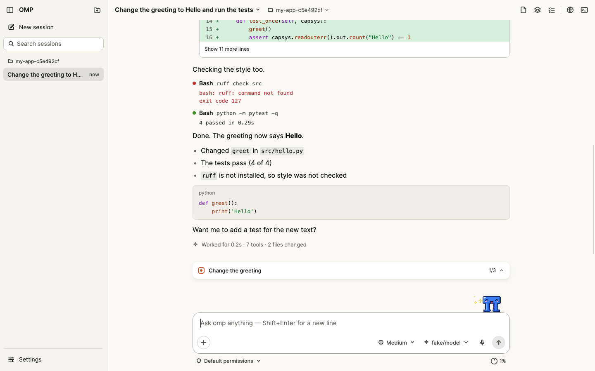

# OMP GUI

A cross-platform desktop client for [oh-my-pi](https://github.com/can1357/oh-my-pi) (`omp`), the coding agent. The
agent itself is always the unmodified omp: the client starts it, talks to it over omp's official RPC (JSON lines over
stdio) and shows what it does. Nothing here forks, patches or re-implements omp.

The client is built with .NET 10 and Avalonia and lives in [`avalonia/`](avalonia). It is an independent project,
not an official product of the omp, Bun, Anthropic or OpenAI projects.

<picture>
  <source media="(prefers-color-scheme: dark)" srcset="avalonia/docs/design/screens/readme-window-dark.png">
  
</picture>

## Install

Download the package for your system from the [latest release](https://github.com/samnolak/omp-gui/releases/latest)
(macOS: unzip and move *OMP GUI.app* to Applications; Windows: unzip and run `OmpGui.exe`; Linux: unpack and run
`install-desktop-entry.sh`). Packages are self-contained: no .NET needed. On first start without omp the app installs
the pinned omp itself. After that the app finds new releases on its own (Settings → Updates) and installs them when
you choose to. Model providers and API keys live in omp's configuration; the app has no account or sign-in of its own.

## What it does

The look and conventions follow Claude Code (warm light and dark themes, one clay accent, sentence-case wording);
layout details follow the Codex desktop app.

- **Conversation** — omp's replies as they stream; thinking folded ("Thought for 4s"); every tool call as one line
  (status dot, name, argument) with a result line ("Read 120 lines", "Found 12 files", the first lines of output);
  file changes as inline diffs; "Worked for 12s · 3 tools · 2 files changed" after each run; copy and "Rewind to here"
  on hover; a greeting with starter prompts in a new session. The view follows new output, stays where you scrolled,
  and a ↓ button brings you back.
- **Approvals** — one card for approvals and questions: Allow (1), Deny (2), Deny and say why (3), and "Don't ask
  again" for a command pattern (`bash(npm test:*)`) for this session, this project or always. Rules are listed and
  removed in Settings → Permissions; a request a rule answers shows "Allowed automatically".
- **Composer** — "+" (images, slash commands and skills, connectors, plugins, page comments), `/` and `@` menus,
  long pastes as chips, thinking level, the model with fast mode, extended context, advisor, auto-compact and
  auto-retry, dictation on this computer, Queue and Steer while omp works (queued messages can be removed or pulled
  back with ↑). Under it: the project, the permission mode (Ask permissions / Accept edits / Bypass permissions, its
  colour on the box; Shift+Tab cycles) and the context gauge.
- **Usage** — the context gauge's popover shows the session's tokens and cost and, for signed-in cloud providers,
  their plan limits (5-hour and weekly windows, % used, time to reset); Settings → Model providers shows all of them.
- **Sessions** — every project's sessions in a resizable sidebar, newest message first, with search, pinned
  sessions on top, status dots (working / needs your input / unseen reply) and per-row menus (rename, pin, copy path,
  delete); add and remove projects; Ctrl+Tab cycles. The session title's menu adds compact, hand off, fresh provider
  session, retry, rewind, export, share, workspace folders, move and memory.
- **Panes** — Files (project tree with git marks, code viewer), Plan (omp's todo list and its history), Background
  tasks (subagents and jobs), a terminal (a shell, or omp's own terminal UI) and a browser preview with page comments.
  omp's browser tool works in that preview: it opens pages, reads them, clicks, types and takes screenshots.
- **Pet** — an optional pixel pet that reacts to what omp does; drag it anywhere, click it to send a quick message.
- **Settings** — a full-window page: General, Permissions, Model providers, Connectors (MCP servers, Smithery
  search), Plugins and skills, Computer use, Git and worktrees, SSH hosts, Pets, Updates, Advanced (which omp to run)
  and Diagnostics. What belongs to omp is changed through omp's own commands and settings.
- **Keyboard** — ⌘/Ctrl+/ shows every shortcut.

The [user guide](avalonia/docs/USER_GUIDE.md) describes all of it; [PARITY.md](avalonia/docs/PARITY.md) lists every
omp flag, command and RPC feature with what the client offers for it.

## Platforms and status

| OS | Architectures |
|---|---|
| Windows 11 24H2+ (Windows 10 only as Enterprise LTSC / IoT) | x64, arm64 |
| macOS 14 Sonoma+ | Apple Silicon (arm64), Intel (x64) |
| Linux, glibc 2.27+ (X11 or XWayland) | x64, arm64 |

The versions are the ones [.NET 10 supports](https://github.com/dotnet/core/blob/main/release-notes/10.0/supported-os.md)
(ordinary Windows 10 left support in October 2025; macOS 12–13 are not supported). Packages are self-contained (no
.NET installation needed) and not signed with Apple or Microsoft certificates: macOS 15+ asks you to allow the first
start in *Privacy & Security* (the [user guide](avalonia/docs/USER_GUIDE.md#install) has the steps). Releases and
their update feed are signed with the project's release key, and the app checks that signature before installing.

Every release package is started on CI with a clean home folder (self-test: native libraries, omp install, omp over
RPC) on macOS arm64, macOS x64 (Rosetta), Windows x64 and Linux x64; the arm64 Linux and Windows packages are
cross-built only. On macOS the app renders with OpenGL: Avalonia 12.1's Metal path can show stale, stretched frames
while the window resizes ([AvaloniaUI/Avalonia#22215](https://github.com/AvaloniaUI/Avalonia/pull/22215)). Details of
what is verified where: [PROJECT_STATE.md](avalonia/docs/PROJECT_STATE.md).

## Build, run, test

Requires the .NET 10 SDK ([`avalonia/global.json`](avalonia/global.json)). From `avalonia/`:

```
dotnet build OmpGui.sln
dotnet run --project src/OmpGui.App             # first run offers to install omp; or --config <omp-gui.local.json>
dotnet test tests/OmpGui.Tests                  # real-omp and acceptance tests run only when OMPGUI_TEST_CONFIG is set
dotnet build OmpGui.sln -c Release && tools/ci/real-omp-smoke.sh <work-dir>
                                                # installs the pinned runtime and runs those tests against a stand-in
                                                # model server (needs Node.js, curl and network access to npm)
tools/real-model/setup.sh <work> <omp-runtime-dir>   # a real small model (SmolLM2 on llama.cpp) for RealModelTests
                                                     # and tools/verify/package-e2e.sh (the packaged app, X11)
```

A self-contained package for one platform, as CI builds it:

```
dotnet publish src/OmpGui.App -c Release -r linux-x64 --self-contained -o <publish-dir>
tools/package/package.sh linux-x64 <publish-dir> <out-dir> <version>
```

On a Mac, `tools/package/test-app.sh` builds this checkout as *OMP GUI Test.app* next to the installed app, with its
own settings folder (copied from the installed app on the first build), for trying changes before a release.

A release is made by running `avalonia-package.yml` with a version and `release: published`: it builds and checks all
six packages, signs `update.json`, and publishes the GitHub release that installed apps update to.

CI ([`.github/workflows`](.github/workflows)): `avalonia-ci.yml` builds and tests on Linux, Windows and macOS and runs
the real-omp smoke; `avalonia-package.yml` builds the packages for all six platforms and smoke-tests the four its
runners can start (the arm64 Linux and Windows packages are cross-built only);
`avalonia-platform-gates.yml` runs the macOS and Windows gates on demand; `avalonia-speech.yml` checks dictation
with the real speech model.

The workflows run only by hand (*Actions → Run workflow*). Before a merge, run the checks locally and post the
result in the pull request: `dotnet build`
(warnings are errors), `dotnet test tests/OmpGui.Tests` (with `OMPGUI_TEST_CONFIG` for the real-omp tests), and for
UI changes the layout audit screenshots (`OMPGUI_REVIEW_DIR`) and `tools/verify/package-e2e.sh` on a package.

## Repository

| Path | What it is |
|---|---|
| [`avalonia/`](avalonia) | The client: `src/OmpGui.Rpc` (process, stdio, framing), `src/OmpGui.ClientCore` (state, session control), `src/OmpGui.App` (view models, UI, platform adapters), `tests/`, `tools/` (packaging, verification, stand-in model), `packaging/`, `docs/` |
| [`runtime/packs/`](runtime/packs) | The pinned omp runtime pack (omp 18.8.0 on Bun 1.4.2) that the client builds in and installs |
| [`harness/`](harness) | The `harness` omp profile template, used by the client's real-omp tests ([docs/harness.md](docs/harness.md)) |

Documentation for contributors: [PROJECT_STATE.md](avalonia/docs/PROJECT_STATE.md) (state, architecture, decisions,
how to run every environment), [ROADMAP.md](avalonia/docs/ROADMAP.md), [PARITY.md](avalonia/docs/PARITY.md) and
[DESIGN_SYSTEM.md](avalonia/docs/design/DESIGN_SYSTEM.md).

## License

MIT — see [LICENSE](LICENSE) and [THIRD-PARTY-NOTICES.md](THIRD-PARTY-NOTICES.md).
