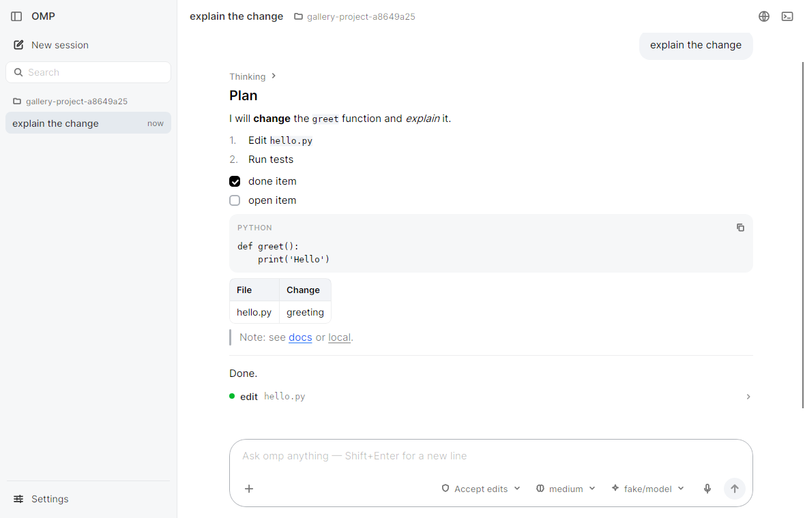
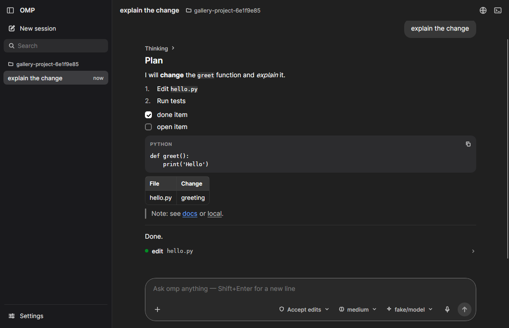
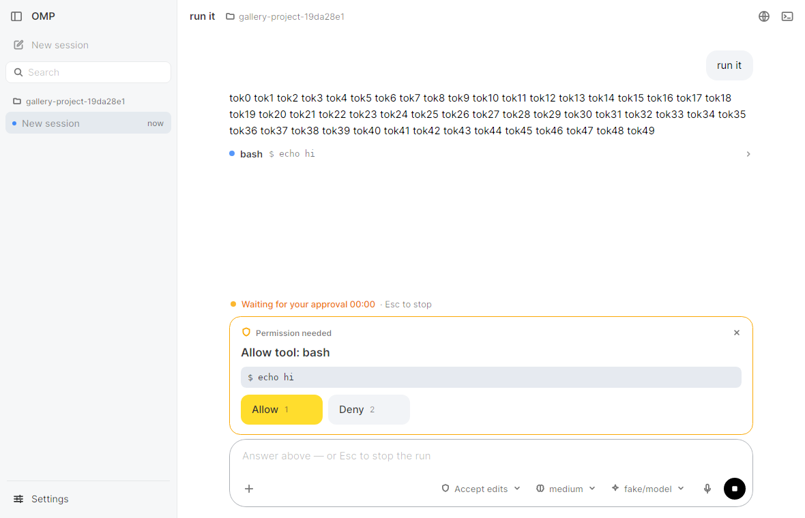
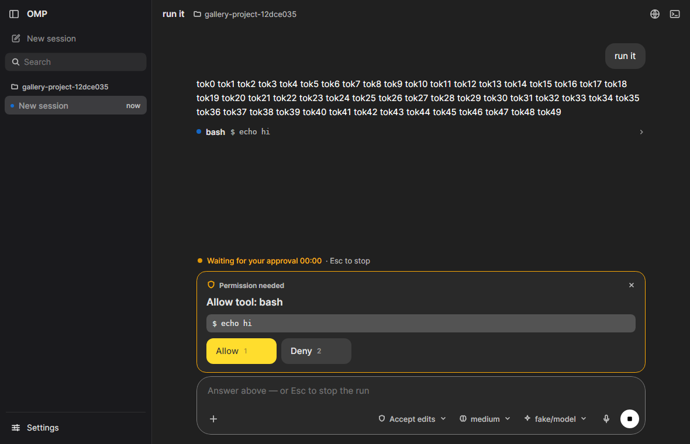

# Design system

The client's own design system: its tokens, component styles and icons. This page says how the pieces are wired and
the conventions to follow when adding UI.

Files:

| File | Role |
|---|---|
| `src/OmpGui.App/Views/Tokens.axaml` | Design tokens: colours per theme, radius, type scale, shadows. Edited by hand |
| `src/OmpGui.App/Views/Styles.axaml` | Component styles (style classes) on top of the tokens |
| `src/OmpGui.App/Views/Icons.axaml` | Line icons (`StreamGeometry`, 24-unit grid) |
| `src/OmpGui.App/Controls/Icon.cs` | `ctl:Icon`, the control that draws them |
| `src/OmpGui.App/App.axaml` | Includes Tokens + Icons as resources, then `FluentTheme`, then Styles |

## Foundations

- **Colours**, light and dark: Claude's classic warm palette — ivory / charcoal surfaces, ink text, **one clay accent**
  (`#C6613F`, hover `#D97757`) for the primary action, switches, checks and selection marks. Blue is only for links
  and the keyboard focus ring. There is no yellow. Theme switching is Avalonia's `ThemeVariant`; every brush is a
  `DynamicResource`.
- **Radius**: 4 / **8 controls** / **12 cards, menus** / **16 composer** / full (`GuiRadiusControl`,
  `GuiRadiusCard`, `GuiRadiusComposer`).
- **Type scale**: UI 14 (`GuiFontUi`), messages 16 on 24 (`GuiFontMessage` / `GuiLineMessage`), captions 12
  (`GuiFontCaption`), code 13 (`GuiFontCode`, in `GuiFontMono`: SF Mono / Menlo / Cascadia Mono / Consolas); 17 for
  section titles, 20 for the page title, 24 for the empty-session greeting. The UI font is **Inter** (SIL Open Font
  License 1.1, bundled through the `Avalonia.Fonts.Inter` package, `.WithInterFont()` in `Program.cs`).
- **Shadows**: `GuiShadow` and `GuiShadowPopup` in light (two soft layers each); in dark only popups keep a shadow,
  cards rely on a hairline.
- **Components**: buttons 32 / radius 8 (medium 44 / radius 12), inputs on surface 1 with a hairline, status badges on
  the soft status colours, cards on surface 1 with radius 12. The client is a desktop window: it restyles Fluent's
  controls with the tokens instead of drawing its own.

## Tokens: three layers

`Tokens.axaml` has one `ThemeDictionaries` entry per theme (`Light`, `Dark`), each with three layers of brushes, plus
theme-independent resources after them.

1. **`Gui*`**: the client's semantic tokens, one `SolidColorBrush` each (`GuiTextPrimary`, `GuiSurface1`,
   `GuiStatusErrorSoft`, …). New XAML and C# use only these (C# looks them up by name: `CodeView`, `MarkdownView`,
   `SyntaxHighlighter`).
2. **Two older alias keys** (`DiffAddedBackgroundBrush`, `DiffRemovedBackgroundBrush`) with the `GuiDiff*Bg` values.
   Do not add new ones.
3. **Fluent keys** (`ButtonBackground`, `AccentButtonBackground`, `TextControlBorderBrushFocused`, `ComboBox*`,
   `CheckBox*`, `RadioButton*`, `ToggleSwitch*`, `MenuFlyout*`, `ToolTip*`, `ProgressBar*`, `ScrollBar*`,
   `SystemAccentColor*`, `SystemControlFocusVisual*`, …) so stock controls follow the tokens without per-control
   styles.

One token needs a word:

- `GuiSidebar` / `GuiPage`: a step below the window (`#F5F4ED` under `#FAF9F5` in light, `#1F1E1D` under `#262624`
  in dark), the same warm hue, so the panes separate without a hard line.

**Adding a token:** add the key to both theme dictionaries (`Light` and `Dark`) in `Tokens.axaml`, then reference it with
`{DynamicResource …}`. Brushes and colours are
per-theme; radius and type sizes go after the theme dictionaries.

## Semantic tokens in use

Values are light / dark; contrast is against the window. Only the keys the styles use are listed; the rest of the
`Gui*` set feeds the Fluent keys.

| Token | Light / Dark | Used for |
|---|---|---|
| `GuiTextPrimary` | #141413 / #FAF9F5 (17.5:1 / 14.4:1) | window foreground, hovered icon buttons and links |
| `GuiTextSecondary` | #3D3D3A / #C2C0B6 (10:1 / 8:1) | `.muted`, `.caption`, `.label`, `.tertiary`, `.caps`, icon buttons, tool output |
| `GuiTextTertiary` | #6B6A64 / #9C9A92 (≥ 4.9:1 on window and sidebar / ≥ 4.7:1, AA) | placeholders, hints, meta (times, line numbers), disabled text |
| `GuiTextLink` / `GuiTextLinkHover` | #1B67B2 / #74ABE2 | `link action`, Markdown links |
| `GuiTextError` / `Success` / `Warning` | #B53333 · #2F7613 · #875A08 / #FE8181 · #7CC24F · #DA9E25 | error text, diff gutter, warning text (all AA) |
| `GuiTextOnAccent` | #FFF | text and icons on the clay accent and on danger fills |
| `GuiTextOnInverse` | #FAF9F5 / #141413 | text on `inverse` buttons and tooltips |
| `GuiWindow` | #FAF9F5 / #262624 | window, conversation |
| `GuiPage` / `GuiSidebar` | #F5F4ED / #1F1E1D | settings page, events panel / sidebar, terminal panel |
| `GuiSurface1` | #FFF / #30302E | cards, section cards, composer, text boxes, current session |
| `GuiSurface2` | #FFF / #30302E | menus / flyouts / popups (with `GuiShadowPopup`; a hairline in dark) |
| `GuiFill1` (+`Hover`, `Pressed`) | ink 5 / 8 / 11 % · ivory 6 / 9 / 12 % | flat-button hover and press, user bubble, chips, attachment, secondary buttons |
| `GuiFill1OnWindow` | #F0EEE6 / #1F1E1D | command output, tool output |
| `GuiCodeBlockBg` / `GuiInlineCodeBg` | #F0EEE6 / #1F1E1D · ink 8 % / ivory 10 % | code blocks / inline code chips |
| `GuiFill2` | ink 10 % / ivory 12 % | tags, selected tab, current menu item, open panel toggle |
| `GuiAccent` (+`Hover`, `Pressed`) | #C6613F (#D97757, #B1532F) | `accent` buttons (Send, Allow…), switch on, check boxes, menu check marks, page-comment pins |
| `GuiBrandMark` | #D97757 | logo, spinner, "changed by omp" sparkle, unread dot |
| `GuiFocus` / `GuiFocusRing` | #2A78D6 / #4C8FE0 | focused text box border; keyboard-focus ring (2 px, inset) |
| `GuiInverse` (+`Hover`, `Pressed`) | #141413 / #FAF9F5 | `inverse` buttons (Stop), tooltips (`GuiTooltip`) |
| `GuiModeManual` / `AcceptEdits` / `Plan` / `Bypass` | #6B6A64 · #8700FF · #006666 · #AB2B3F / #9C9A92 · #AF87FF · #48968C · #FF6B80 | permission-mode pill, composer focus border and Send in that mode |
| `GuiStatusRunning` / `Waiting` / `Unread` | #2C7A39 · #2C84DB · #D97757 / #89D185 · #4C8FE0 · #D97757 | session status dots |
| `GuiDiffAddedBg` / `Text`, `GuiDiffRemovedBg` / `Text` | green / red at 16–18 % (dark 14–15 %) with AA text | diff rows, calm in dark |
| `GuiBorderSoft` / `GuiBorder` / `GuiBorderStrong` | ink or ivory at 10 / 20 / 40 % | dividers, menus, tool rows / text boxes, composer / composer while focused, switch track off |
| `GuiBorderDarkOnly` | transparent / ivory 10 % | card hairline (dark only) |
| `GuiStatus*Soft` | pale status fills / deep muted fills | badges, `notice`, `banner error`, `chip danger` |
| `GuiStatusInfo` / `Success` / `Error` / `Warning` | | status dots and marks (3:1 is enough for graphics) |
| `GuiShadow` | `0 1 2 #000 4%, 0 4 14 #000 6%` / none | cards, composer, raised segment |
| `GuiShadowPopup` | `0 2 6 #000 6%, 0 10 32 #000 12%` / `0 10 32 #000 40%` | menus, drawer sidebar |
| `GuiBackdrop` | ink 20 % / black 35 % | `Border.scrim` behind a drawer or a sheet |
| `GuiRadius4` / `8` / `12` / `Full`; `GuiRadiusControl` / `Card` / `Composer` | 4 / 8 / 12 / 999; 8 / 12 / 16 | 4: tags · 8: buttons, menu rows, inputs · 12: cards, menus, `md` buttons, tool output · 16: composer · full: chips, badges |
| `GuiFontUi` / `Message` (+`GuiLineMessage`) / `Caption` / `Code` | 14 / 16 (24) / 12 / 13 | menus and inputs / `.body` / `.tertiary`, `.caption`, tooltips / `.mono` |
| `GuiFontL` / `M` / `S` / `Xs` / `Xl` / `Xxl` | 17 / 15 / 13 / 12 / 20 / 24 | `.section` / card titles, `md` buttons / buttons, `.muted`, `.label` / `.caps` / `.page-title` / greeting |

Fluent's own `ControlCornerRadius` is 8, `OverlayCornerRadius` 12 and `ControlContentThemeFontSize` 14.

## Layout: Claude Code as the reference

Structure, placement and sizes follow Claude Code's desktop / web client (behaviour and proportions only — nothing
copied); colours, radius, type and components are the client's own (above).

| Area | Arrangement | Size |
|---|---|---|
| Sidebar | top row: sidebar toggle · name · add project; New session (shortcut on hover); search; **Pinned** (omp's pins), then sessions **grouped by project** (folder header: ⊖ remove from sidebar and + new session on hover, both with tooltips) as one-line rows (title · age, or a status dot: running pulses `GuiStatusRunning`, needs input `GuiStatusWaiting`, unseen reply `GuiStatusUnread`; pin and ⋯ replace it on hover / focus); bottom: Update · Settings; the right edge drags the width (2 px `GuiFocus` line while hovered) | 260 default, 220–480 (kept); top row 48 (level with the header); rows 32 / 36, radius 8; open item on fill 2 |
| Header | session title (rename) · project · branch — on the right the pane toggles as 20 px icon buttons (Files · Plan · Background tasks │ Terminal · Browser), lit (`icon on`, fill 2) while their pane is open, tooltips with the shortcut; when the title, project and branch would not fit beside them they fold into ⋮ (the Views menu, with labels; `MainWindow.FoldPaneToggles`); sidebar toggle and settings appear here only while the sidebar is hidden; no divider line | 48 high, 16 px from the sidebar |
| Conversation | one centered reading column (`Styles.Session.axaml`); your messages right-aligned bubbles (fill 1, card radius) with Rewind to here and Copy beside them on hover; assistant prose at the message size (16 / 24), paragraphs 12 apart; tool calls as Claude Code's lines: status dot (grey blinking while it runs, green done, red failed) · **Name** (`Bash`, `Read`, `Search`) · what it acts on in mono secondary (never raw JSON, no `$ `) · +/− · duration from 0.1 s · a chevron on hover when there is more; under it, 24 px in, what it gave — a summary in words (*Read 120 lines*, *Found 12 files*, *Added 2 lines, removed 1 line*, *Wrote 27 lines*) or its first 3 output lines in mono with **… +N lines**; a running call shows its newest 3 lines there; opened, the whole output on the code surface or the change; a reply that only calls tools takes no room; "Thinking… 4s" pulses while the model thinks, then reads "Thought for 4s" (folded); a run ends in "Worked for 12s · 3 tools" (no duration under 0.1 s) which carries the reply's Copy on hover — a reply with no such line has its own Copy line | 768 max width; bubble max 600; tool line 28 high |
| Empty session | the app mark and "What should we work on in ‹project ▾›?" (heading 5, 24) centered over the message box, the project an outlined chip that opens the project menu; three starter prompts as outlined pill chips that fill the box; shown while the conversation has only notices | 640 max |
| Setup | omp cannot start in a new session: the page shows only what to do — the app mark (onboarding) or a warning mark, a title, one sentence, one accent action and the alternatives, the raw error under *Show details*; no message box. Mid-conversation the same content is a card above the message box | 520 max |
| Questions | one card chrome for approvals, questions, confirmations and inputs (`Border.dialog`): a mark (shield for approvals, sparkle otherwise) and the title in words — "omp wants to run a command", or the question — then the command or details in a mono code box, omp's reason as a muted line, the answers; choices numbered 1–9 (the digit picks, omp's "(Recommended)" as a `status` badge), approvals Allow `1` / Deny `2` (omp offers no "always allow"), close (×) in the card's corner | — |
| Composer | the message field on a card; above the text: the slash menu, queued messages (grey one-liners with their tag and ×), long pastes ("Pasted text +N lines" chips with ×), page comments (numbered chips), images; in the card under the text, left: "+" (an outlined 32 px circle mirroring Send; a menu: attach images, commands and skills, connectors, plugins, comment on the page); right: thinking effort, model, dictation, then a round send / stop button. Send is the accent (the mode's colour in Accept edits / Bypass) and a grey fill-2 circle with a tertiary arrow while there is nothing to send. The permission mode colours the card's focus border (Ask: `GuiBorderStrong`; Accept edits / Bypass: their mode colour) and its pill (icon shield / pencil / alert). The model menu opens above the card, its right edge on the model chip, so the message stays readable; the thinking menu's rows are a label and a one-line description; the slash menu lists what only omp's terminal runs last, under a `TextBlock.menu-group` heading. Under the card, outside it (as Claude Code and Codex keep session settings out of the box): the project folder (new session only) and the permission mode on the left (its menu opens upward from the pill's left edge), the context gauge on the right, in 28 px quiet pills. Styles: `Styles.Composer.axaml` | radius 16; field min 48; toolbar buttons 32; send and "+" 32 circles, 10 px from the edges; row under the card 28 |
| Shortcut sheet | ⌘/ (Ctrl+/) or `/hotkeys`: a menu card over a scrim, its groups in 300 px columns (two when the window allows), each row the action (a tertiary note under it when it applies only sometimes) and its keys as `Border.keycap` (fill 1, hairline, radius 4, 12 px medium secondary); Esc, × or the scrim closes it | max 660 wide |
| Preview | right of the conversation, full height, resizable (`Controls/PreviewPanel`): back · forward · reload · address · open in the browser · close in a 48 px toolbar level with the header; local server addresses from tool output as chips; the native web engine of the OS (WebView2 / WKWebView / WebKitGTK), a card with "Open in browser" when there is none | 520 default, 320 min |
| Annotate (preview) | Codex's page comments: the 💬 toggle (`icon on` while active) puts the page in annotate mode — drawn by the page script in a closed shadow root: a 2 px blue outline with a dark tag (`button#buy 220×56`), a white comment card (radius 12, textarea, Cancel / clay Comment), numbered **pins** (22 px clay circles, white number, white ring) and a dark hint pill at the bottom; the panel lists the comments under the page (pin number, comment, element in mono tertiary, ×) with Clear and an accent Send; the composer shows "N comments on the page" as an attachment chip | pins 22; list max 200 |
| Dictation | the mic button or Ctrl/⌘+Shift+Space turns the message field into the dictation bar (`Controls/DictationBar`): cancel · level waveform · time · finish (accent circle); Esc cancels, Enter inserts the text at the caret (never sends) | field height |
| Cards above the composer | recovery, sign-in link, tasks, the activity line and the approval / question card; while the conversation is shorter than its view they are drawn up to just under its last row (`MainWindow.FollowTranscript`), so a question follows the conversation instead of waiting at the bottom; they scroll when the window is too low for them and the composer, which always stays on screen (a new question scrolls its answer buttons into view) | same 768 column |
| Activity line | in the column above the composer, in a slot that keeps its 20 px when idle (a run starting or ending moves nothing); while omp works or after an error: pulsing dot · what it does now ("Thinking", "Writing", "Running bash", "Waiting for your approval" in the warning colour) · elapsed time · "Esc to stop"; model, RPC and context in its tooltip | 12 px |
| Pet | a pixel pet (`Controls/PetPerch`, `Controls/PetView`, data in `Pets/`) on the composer's top edge, 20 px from its right end, its feet on the border; it has a band of its own (the composer's top margin grows by the pet's height), so it never covers the conversation, a card or a question; a click opens a speech bubble to its left (surface 2, radius 12) and never takes focus; hidden on the setup screen, the settings page and in a window under 520 px tall (the band goes with it). Art: 24×24 pet pixels (`PetArt`) with a one-pixel outline, three-step shading, a soft highlight, blush, 2×3 eyes with a glint and a soft contact shadow; a 12-pixel room on its left for effects. Motion (`PetLife`): eased breathing, blinks every 2–6 s, glances, an idle action every 8–20 s, each mood's own motion, eased changes between moods, a look at the pointer, a hop on click, a glance at the composer while typing; drawn nearest-neighbour at screen pixels, and it wakes only when the picture changes, only while shown in the active window; a mood that lasts (asleep, waiting, omp stopped) comes to rest on a still. Previews: `screens/pets-preview-light.gif`, `screens/pets-preview-dark.gif` | 48 (medium, 2 px per pet pixel) / 32 (small, 4/3) tall |
| Tasks | omp's todo list as one line above the composer: the task in progress, done / total, a chevron; open, the whole list with checkboxes (done: struck through; in progress: an info-coloured box with a dot) | 32 high line; list max 180 |
| New session | the greeting and the composer together in the middle of the page; with the first message the composer goes to the bottom | — |

**Keeping things in place.** The conversation stays on its latest message through resizes, panels opening (terminal,
tasks, a question, the preview) and rows growing — re-anchored inside the layout pass, so no frame is drawn at the old
offset — until the reader scrolls away (wheel, scroll bar, keys); then "Jump to latest" appears. Side panels never take
the conversation below 420 px: the sidebar gives way first, then the preview narrows to its 320 minimum; a window too
narrow for both shows the preview over the conversation until it is closed (`MainWindow.FitPanels`).

Model and thinking effort live in the composer, next to the message they apply to; the permission mode and the context
gauge sit in the row under it. The model list opens upwards from its chip. Each row sheds labels only as far as its
content needs to fit (`MainWindow.FitComposerToolbar`, measured): in the card a shorter model, the thinking pill as its
icon, the model as its icon, then no thinking pill; under it a shorter project, the permission pill as its icon, the
context without its percentage, the project as its icon. Voice and send always stay on screen.

## Components (Styles.axaml)

### Buttons

| Classes | Looks like |
|---|---|
| *(none)* | secondary: fill 1, primary text, 32 high, radius 8, 13 px medium; hover / pressed step the fill |
| `accent` | primary: clay (`GuiAccent`) fill, white text, hover `GuiAccentHover`; disabled = the same at 40 % |
| `danger` | the one destructive action of a confirmation: error fill, white text (not on `chip`, `menu-item`, `flat`) |
| `md` | 44 high, radius 12, 15 px (combine: `accent md`) |
| `inverse` | ink in light, ivory in dark (Stop); disabled = the same at 40 % |
| `flat` | no fill until hovered (fill 1), pressed fill 1 pressed |
| `icon` | 32 × 32, no fill, secondary foreground → primary on hover; `icon wide` for icon + text |
| `link` | no chrome, 12 px secondary text → primary on hover |
| `link action` | blue link text (`GuiTextLink`) at 13 px |
| `chip` | full radius pill, 32 high, fill 1 (also `ComboBox.chip`); `chip danger` = error soft + error text |
| `chip ghost` | the composer's pills: no fill until hovered, secondary text |
| `send` | 32 px circle, icon only — `accent send` (Send), `inverse send` (Stop) |
| `round` | full radius for an `icon` button (attach, dictation) |
| `icon on` | a panel toggle whose panel is open: fill 2, primary icon |
| `segment` in `Border.segmented` | a 2–3 option choice: fill 1 track (radius 8), the chosen segment (radius 6) raised off it (`GuiSegmentSelected`: white in light, #4A4945 in dark) with the small shadow; an unavailable segment is tertiary text on the track |
| `sidebar-action` | a flat 36 px row with an icon (New session, Settings, Back to app); `current` = fill 2 |

`accent` is Fluent's `AccentButton` theme; its colours come from the Fluent keys in `Tokens.axaml`, not from a style
in `Styles.axaml`. Other button classes are scoped to one
place: `title`, `option` (dialog choices), `session`, `sidebar-action` (`primary` = New session), `menu-item`,
`ToggleButton.expander` (the chevron rotates 90° when checked), `ToggleButton.tool-row` (a whole tool line; its
`Icon.chevron` rotates when the output is open), `ToggleButton.todo-head` (the task line).

**On / off and done / not done.** A setting that is on or off is a **switch** (`ToggleButton.switch`: a 36 × 20
pill; off = a mid-grey track (`GuiBorderStrong`, darker on hover), on = the accent, a white knob that slides; focus =
the focus ring inside the track; disabled at 40 %), in a row with its name and description on the left —
as in Claude Code's settings; not a check box. A task that is done or not is a **checkbox** (`Border.md-check`, 16 px,
radius 4, a strong border; `checked` = inverse fill with a check; `active` = info border; `dropped` = pale
with a cross), drawn — never the ☑ / ☐ / ◐ glyphs, which every font draws differently.

### Inputs

`TextBox` sits on surface 1 with a `GuiBorder` hairline, 44 high (medium; `search` and `sm` are small, 32), radius 8;
the border turns `GuiBorderHover` on hover and **focus blue** (`GuiFocus`, still 1 px) on focus. Placeholders are the
tertiary text at full strength (AA). `TextBox.search` leaves room for a leading `ctl:Icon` in `InnerLeftContent`. The
composer is the exception: `Border#ComposerBox` is the field (surface 1, `GuiBorder`, radius 16) and the `TextBox`
inside stays bare in every state.

### Cards and surfaces

- `Border.card`, `.dialog`, `.banner`, `.widgets`: surface 1, radius 12, `GuiShadow` (a shadow in light, a 1 px
  `GuiBorderDarkOnly` hairline in dark), padding 16,14 (`widgets` 14,10). `banner error` is flat error soft.
- **Dialog card** (`Border.dialog`, `Styles.Session.axaml`): the card above with a `GuiBorder` hairline in both themes —
  approvals and questions look the same. A brand-mark icon (`ctl:Icon.dialog-mark`), the title (`dialog-title`, 15
  semibold), the details in `Border.details` (code surface, hairline, radius 8), then **Allow** (`accent md`) and
  **Deny** (`md`) or the numbered `Button.option`s.
- `Border.menu` and every `Flyout` / `MenuFlyout` / `ContextMenu`: surface 2, radius 12, soft hairline, popup shadow,
  6 px around the rows. Rows (`Button.menu-item`, `MenuItem`) are 14 px, radius 8, fill 1 on hover, fill 2 when
  `current`. A check mark for the chosen row is `ctl:Icon.menu-check` in the accent, never the link blue.
- `ToolTip`: inverse (`GuiTooltip` with `GuiTextOnInverse`), 12 px, radius 6, padding 8,5, at most 320 wide.
- Scroll bars: Fluent's overlay bars, thin until hovered; the thumb is `GuiBorder`, `GuiBorderStrong` on hover.
- `Border.notice`: transcript notices; plain text by default, `notice error` / `notice warning` get a soft status
  fill, radius 8 and padding 12,8.
- `Border.status` badges: full radius, 20 high, 12 px medium. `status running` (info soft / link text),
  `status done` (success), `status failed` (error), plain `status` neutral.
- Transcript (`Styles.Session.axaml`): `Border.user-bubble` (fill 1, radius 12), `Button.row-action` (28 px tertiary
  icons, shown on the row's hover or focus), tool lines (`ToggleButton.tool-row` with `Ellipse.tool-dot`,
  `TextBlock.tool-name` 14 semibold, `.tool-summary` mono secondary, `.tool-took`), their result
  (`StackPanel.tool-result` / `TextBlock.tool-result`, 13 secondary, mono for output, `.failed` in error text;
  `Button.tool-more` "… +N lines") and `Border.tool-output` (code surface, radius 8). `Border.command-output` and
  `Border.codeblock` are on `GuiCodeBlockBg` with a soft hairline, radius 8; a code block has its language (lowercase,
  12 tertiary) and a copy icon that shows on hover and turns into a check for 1.5 s. Inline code is a
  `GuiInlineCodeBg` chip (radius 4) drawn under the text by `MarkdownView` (mono at 0.875 of the text, still
  selectable with it); list markers are tertiary in an 18 px column; table headers on fill 2. Running dots
  (`tool-dot running`, `state-dot running`) and the live "Thinking…" pulse; nothing animates while idle.
- `Border.tag` (fill 2, radius 4), `Border.attachment` (fill 1, radius 12), `Border.tab` / `.tab.selected`.

### Sidebar and sessions

`Border.sidebar` is `GuiSidebar` with a pale right border; its styles are in `Styles.Workspace.axaml`. Actions are flat
`sidebar-action` rows. Session rows are `Button.session` (radius 8, 14 px) under `TextBlock.group-label` headings
(12 px medium, text 2). The open session is `session current` (fill 2). The list's own `ListBoxItem` hover/selection
chrome is switched off. Row actions (`session-actions`: pin, ⋯) are hidden and not hit-testable until the row is
hovered or holds the focus; the age gives way to them. The row menu is `Views/Sidebar/SessionRowMenu` (Rename · Pin ·
Copy path │ Delete…), used by both the right-click menu and ⋯.

### Settings page

The settings fill the window: the sidebar hides, and `Border.settings-sidebar` (240, `GuiSidebar`) takes its place
with **Back to app** (`sidebar-action`, Esc does the same), the `settings-title` and the pages as `Button.settings-nav`
rows under `TextBlock.settings-group` headings. Below 760 px the pages become a strip of `settings-nav tab` buttons
under a header (back arrow · `page-title`); the strip fades at an edge with more tabs past it. Each group
is a `Border.section-card`: surface 1, radius 12, padding 20,18, dark-mode hairline, **no shadow**. Inside:
`TextBlock.section` title (17 px semibold), `.muted` description, `TextBlock.label` above fields, 1 px `GuiBorderSoft`
separators, and at most one `accent md` action (Save and restart omp).

### Type classes

`.muted` (secondary, 13), `.tertiary` (12), `.body` (16 / line 24, message text), `.mono` (`GuiFontMono`, 13),
`.error`, `.warning`, `.caption` (12 semibold secondary), `.label`, `.section`, `.page-title`, and **`.caps`**: 12 px
semibold, letter spacing 0.8, secondary, for the few small section labels. The style does not uppercase; prefer
sentence-case labels.

## When to use which

- **One primary action per card.** `accent` marks the action the card exists for (Allow, Yes, Submit, Send, Install,
  Save and restart omp, Download). Alternatives next to it are default buttons (Deny, No, Cancel, Copy); ways out are
  `flat` (Dismiss, Not now, Show in folder) or `link`.
- **Use `md` for the buttons of a card's main decision** (approval, confirm, recovery banner, settings Save / Done);
  small (default) elsewhere.
- **`inverse` stops**: Stop in the composer. It is not a second primary.
- **Destructive or risky state uses the error colours**: the Bypass permissions mode (`GuiModeBypass` on its pill, the
  composer's focus border and Send), `notice error` around the bypass confirmation and its `danger` "Bypass
  permissions" button, `status failed`, `banner error`, `menu-item danger` (error text), and a `danger`
  button for the one destructive action of a confirmation.
- **Status is shown with soft fills plus a mark in the status colour, never by coloured small text**: badge text is
  primary with a coloured dot (`Border.status` > `Ellipse`); error and warning lines are primary text with an
  `IconAlert` in `GuiStatusError` / `GuiStatusWarning` (`Icon.error-mark` / `Icon.warning-mark`). Text in a status
  colour on its own pale fill measures 2.5–3.9:1; graphics need only 3:1.
- **Elevation, not borders, separates surfaces in light**; dark mode relies on the `GuiBorderDarkOnly` hairline
  because there are no shadows there.
- Reading text uses `body` (`GuiFontMessage` 16 / 24); dense UI uses 13–14 px; `GuiFontXl` only for the page title.

## Icons

Line icons drawn for this client (no third-party set), `StreamGeometry` resources in `Icons.axaml`:

`IconMenu` · `IconPlus` · `IconFolder` · `IconSearch` · `IconTerminal` · `IconSettings` · `IconArrowUp` · `IconStop` ·
`IconAttach` · `IconMic` · `IconClose` · `IconChevronDown` · `IconChevronRight` · `IconCopy` · `IconShield` ·
`IconSparkle` · `IconCheck` · `IconLink` · `IconAlert` · `IconPanelLeft` (sidebar toggle) · `IconCompose` (new session) ·
`IconBrain` (thinking effort) · `IconArrowLeft` · `IconArrowRight` · `IconReload` · `IconExternal` · `IconGlobe` (preview).

```xml
<ctl:Icon Data="{StaticResource IconTerminal}" Size="20" />
<ctl:Icon Data="{StaticResource IconStop}" Size="16" Filled="True" />
```

- `ctl` is `xmlns:ctl="using:OmpGui.App.Controls"`.
- Paths are drawn on a **24-unit grid**; `Size` (default 18) scales them. The stroke is **1.75 px** at every size
  (`StrokeThickness` is in screen pixels), with round caps and joins; `Filled="True"` also fills the shape.
- The icon is stroked in the **inherited foreground** (`TextElement.Foreground`), so it follows hover, pressed and
  disabled states of the button around it and both themes. To tint one, set `TextElement.Foreground` on it or its
  container (as the recovery and link banners do).
- Sizes in use: 20 in header and composer icon buttons, 18 in the sidebar and banner discs, 14–16 inline in chips,
  menus and small buttons.

**Adding an icon:** draw it on a 24 × 24 grid with open strokes (no fills unless it is meant for `Filled`), keeping
about 3 units of padding like the existing ones; add `<StreamGeometry x:Key="IconName">…</StreamGeometry>` to
`Icons.axaml`; use it through `ctl:Icon`. Do not embed colours.

## Accessibility

- Every **icon-only button needs `AutomationProperties.Name`** (and a `ToolTip.Tip`); the icon has no text for screen
  readers. Examples in `MainWindow.axaml`: *Show sidebar*, *Files*, *Terminal*, *Settings* (header), *Attach images*,
  *Dictate* (composer), *Remove attachment*, *Close terminal*, *Hide terminal panel*, and the tool-row expander
  (*Show tool output*). Buttons whose content is a template (sessions, menu items, dialog options) bind it to their
  label.
- **Focus rings are blue and keyboard-only** (`:focus-visible`): `GuiFocusRing`, a 2 px `GuiFocus` ring drawn inset
  as a shadow on buttons, toggles, switches, combo boxes and list items (nothing moves, nothing is clipped); a focused
  `TextBox` gets a 1 px `GuiFocus` border. Fluent's focus adorner is switched off.
- Keep keyboard access keys on dialog buttons (`<AccessText Text="_Allow" />`, `_Deny`, `_Yes`, `_No`, `Dis_miss`).
- Text colours come only from the `GuiText*` tokens (and `GuiTextOn*` on filled buttons), never from literal colours,
  so both themes keep their contrast pairs.

## Screens

Rendered by `DesignGalleryTests` (headless, 1180 × 760).

| | Light | Dark |
|---|---|---|
| Transcript |  |  |
| Approval |  |  |

More: [running command, light](screens/after/design-running-light.png) ·
[running command, dark](screens/after/design-running-dark.png) ·
[preview, light](screens/after/design-preview-light.png) ·
[preview, dark](screens/after/design-preview-dark.png) ·
[dictation, light](screens/after/design-dictation-light.png) ·
[new session, light](screens/after/design-new-session-light.png) ·
[new session, dark](screens/after/design-new-session-dark.png) ·
[tasks, light](screens/after/design-todos-light.png) ·
[first run, light](screens/after/design-first-run-light.png) ·
[first run, dark](screens/after/design-first-run-dark.png) ·
[settings, light](screens/after/design-settings-light.png) ·
[settings, dark](screens/after/design-settings-dark.png).

To re-render (from `avalonia/`):

```sh
taskset -c 1-3 dotnet build tests/OmpGui.Tests
OMPGUI_SHOT_DIR=$PWD/docs/design/screens/after taskset -c 1-3 \
  dotnet test tests/OmpGui.Tests --no-build --filter FullyQualifiedName~DesignGallery
```

The test writes every screen above, including the new-session and tasks screens.
